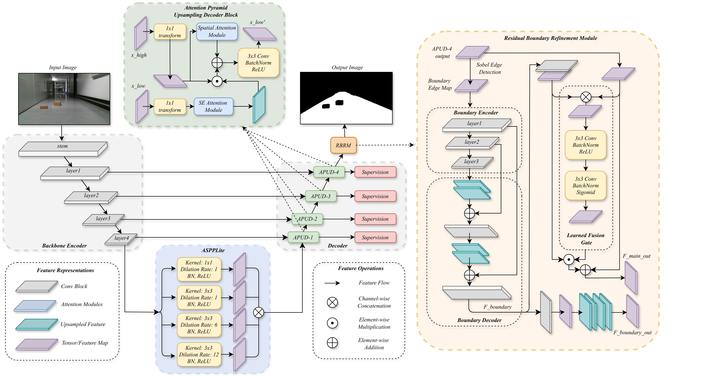

# AURASeg

**Attention-guided Upsampling with Residual Boundary-Assistive Refinement for Semantic Segmentation**

Semantic segmentation for robot drivable area detection in autonomous mobile robots.
Paper: https://arxiv.org/abs/2510.21536

## Overview

AURASeg is designed for accurate drivable area segmentation in unstructured outdoor environments. The architecture combines:

- ResNet-50 backbone with ASPP-Lite decoder
- Attention-based Parallel Upsampling Decoder (APUD)
- Residual Boundary Refinement Module (RBRM)

Trained on NVIDIA RTX 5060 GPU. Inference tested on NVIDIA Jetson Nano for edge deployment.

## Architecture



## Results

### MIX Dataset (Ours)

| Model | IoU | F1 | B-IoU | B-F1 |
|-------|-----|----|----|------|
| FCN | 98.57 | 99.28 | 65.02 | 77.89 |
| PSPNet | 98.70 | 99.35 | 76.39 | 85.89 |
| DeepLabV3+ | 98.75 | 99.37 | 77.99 | 87.00 |
| UPerNet | 98.79 | 99.39 | 78.63 | 87.38 |
| SegFormer | 98.85 | 99.42 | 77.63 | 86.83 |
| Mask2Former | 98.81 | 99.40 | 77.40 | 86.61 |
| PIDNet | 98.35 | 99.17 | 63.34 | 76.56 |
| **AURASeg (Ours)** | **98.97** | **99.48** | **81.24** | **89.05** |

### CARL-D Dataset

| Model | IoU | F1 | B-IoU | B-F1 |
|-------|-----|----|----|------|
| FCN | 77.35 | 87.23 | 2.98 | 4.48 |
| DeepLabV3+ | 80.12 | 88.96 | 4.16 | 5.97 |
| PIDNet | 79.79 | 88.76 | 4.08 | 6.16 |
| **AURASeg (Ours)** | **80.41** | **89.14** | **4.84** | **6.83** |

## Repository Structure

```
├── benchmark_models/          # Training and evaluation scripts
│   ├── auraseg_v4_resnet.py   # AURASeg model definition
│   ├── train_benchmark.py     # Training script
│   ├── eval_all_benchmarks.py # Evaluation pipeline
│   └── model_factory.py       # Model creation utilities
├── kobuki-yolop/
│   └── model/new_network/     # Network architectures
│       └── ablation/          # Ablation study variants (V1-V4)
├── runs/                      # MIX dataset results
│   ├── auraseg_v4_resnet50/   # Main model outputs
│   ├── benchmark_*/           # Benchmark model outputs
│   └── plots/                 # Training curves and visualizations
└── runs_carl/                 # CARL-D dataset results
```

## Pretrained Weights & Dataset

**Google Drive:** [Download Here](https://drive.google.com/drive/folders/1BITy28E2k_Qxc3D9NG-TmrdfWwh-ZxFU?usp=sharing)

Contents:
- `checkpoints/MIX_dataset/` - Models trained on MIX dataset
- `checkpoints/CARL_dataset/` - Models trained on CARL-D
- `CommonDataset/` - MIX dataset (images + labels)

*Note: CARL-D dataset requires permission from the original authors.*

## Usage

### Training

```bash
python benchmark_models/train_auraseg_v4_resnet.py \
    --data_dir ./CommonDataset \
    --output_dir ./runs/auraseg_v4_resnet50
```

### Evaluation

```bash
python benchmark_models/eval_all_benchmarks.py \
    --data_dir ./CommonDataset \
    --checkpoint ./runs/auraseg_v4_resnet50/checkpoints/best.pth
```

## Requirements

- Python 3.8+
- PyTorch 2.0+
- torchvision
- segmentation-models-pytorch
- opencv-python
- albumentations

```bash
pip install torch torchvision segmentation-models-pytorch opencv-python albumentations
```

## License

MIT License
