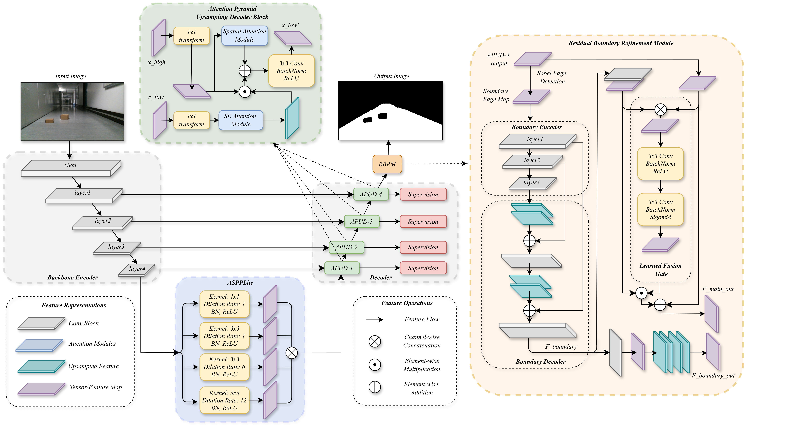

# AURASeg

**Attention-Guided Upsampling with Residual-Assisted Boundary Refinement for Drivable-Area Segmentation**

AURASeg is a ResNet-18 based drivable-area segmentation model that combines a 128-channel Attention Progressive Upsampling Decoder (APUD) with a Residual Boundary Refinement Module (RBRM). The implementation in this repository corresponds to the current paper/preprint.

- Paper: https://arxiv.org/abs/2510.21536
- Task: binary drivable-area / free-space segmentation
- Input resolution used in the paper: `384 x 640`
- Training GPU: NVIDIA GeForce RTX 5060
- Embedded evaluation device: NVIDIA Jetson Nano 4 GB

## Method

The paper implementation uses:

- **Encoder:** ImageNet-pretrained ResNet-18
- **Context:** ASPPLite at the bottleneck
- **Decoder:** four APUD stages with a shared 128-channel width
- **Boundary refinement:** Sobel-informed RBRM with a learned residual gate
- **Training-only heads:** four auxiliary segmentation heads and one boundary head



## Canonical paper code

The files below are the canonical implementation/evaluation path for the paper:

```text
benchmark_models/
├── auraseg_r18_wacv.py          # AURASeg-R18 / APUD-128 / RBRM model
├── train_auraseg_r18_wacv.py    # MIX training and ablation entry point
├── train_auraseg_r18_carld_rgb.py # CARL-D training entry point
├── wacv_losses.py               # focal, Dice, auxiliary and boundary losses
├── wacv_metrics.py              # region and boundary metrics
├── unified_dataset.py           # MIX/CARL-D loading and CARL-D RGB decoding
├── train_benchmarks_carld_rgb.py # controlled general-baseline trainer
├── train_fbrnet_wacv.py         # FBRNet adaptation
├── baseg_wacv_model.py          # BASeg adaptation wrapper
├── compute_complexity.py        # parameter/FLOP reporting
└── benchmark_hardware_metrics.py # hardware profiling utilities
```

For the exact split definitions, metric protocol and hyperparameters used in the paper, see [`REPRODUCIBILITY.md`](REPRODUCIBILITY.md).

## Datasets and splits

The reported evaluation uses three settings.

| Dataset | Train | Validation | Test |
|---|---:|---:|---:|
| Gazebo | 2,483 | 294 | 420 |
| GMRPD | 3,000 | 360 | 536 |
| CARL-D | 8,372 | 1,046 | 1,046 |

**MIX** is the fixed union of the held-out Gazebo and GMRPD partitions used by the paper. It is not a separate dataset.

Expected CommonDataset-style layout:

```text
CommonDataset/
├── images/
│   ├── train/
│   ├── val/
│   └── test/
└── labels/
    ├── train/
    ├── val/
    └── test/
```

CARL-D is loaded through `benchmark_models/unified_dataset.py`. The RGB label image is decoded before resizing, and discrete masks are resized with nearest-neighbor interpolation.

## Evaluation protocol

Region metrics are computed from accumulated foreground pixels. Boundary metrics are computed per image and macro-averaged. A 3x3 morphological gradient extracts predicted and target boundaries; both boundaries are dilated by `k=2` for the main reported BIoU/BF1 results. The implementation is in [`benchmark_models/wacv_metrics.py`](benchmark_models/wacv_metrics.py).

The comparison is controlled at the dataset split, input resolution and evaluation levels. Common training settings are used where compatible, while architecture-specific objectives are retained for models whose defining training formulation requires them. The repository exposes the exact scripts/configuration used for the reported experiments rather than claiming that every baseline represents its independently optimized published setting.

## Main paper results

### MIX

| Model | IoU | F1 | BIoU | BF1 |
|---|---:|---:|---:|---:|
| FCN-R50 | 0.9857 | 0.9928 | 0.6502 | 0.7789 |
| PSPNet-R50 | 0.9870 | 0.9935 | 0.7639 | 0.8589 |
| UPerNet-R50 | 0.9879 | 0.9939 | 0.7863 | 0.8738 |
| SegFormer-B2 | 0.9885 | 0.9942 | 0.7763 | 0.8683 |
| Mask2Former | 0.9881 | 0.9940 | 0.7740 | 0.8661 |
| PIDNet-L | 0.9835 | 0.9917 | 0.6334 | 0.7656 |
| **AURASeg** | **0.9897** | **0.9948** | **0.8124** | **0.8905** |

Boundary-focused comparison:

| Model | IoU | F1 | BIoU | BF1 |
|---|---:|---:|---:|---:|
| FBRNet | 0.9860 | 0.9929 | 0.6669 | 0.7922 |
| BASeg | 0.9875 | 0.9937 | 0.7660 | 0.8609 |
| **AURASeg** | **0.9897** | **0.9948** | **0.8124** | **0.8905** |

### CARL-D

| Model | IoU | F1 | BIoU | BF1 |
|---|---:|---:|---:|---:|
| FCN-R50 | 0.9575 | 0.9783 | 0.5269 | 0.6691 |
| PSPNet-R50 | 0.9579 | 0.9785 | 0.5265 | 0.6683 |
| UPerNet-R50 | 0.9567 | 0.9779 | 0.5299 | 0.6721 |
| SegFormer-B2 | 0.9574 | 0.9782 | 0.5263 | 0.6671 |
| Mask2Former | 0.9450 | 0.9717 | 0.4491 | 0.5999 |
| PIDNet-L | **0.9584** | **0.9788** | 0.5391 | 0.6791 |
| **AURASeg** | 0.9547 | 0.9768 | **0.5424** | **0.6811** |

Boundary-focused comparison:

| Model | IoU | F1 | BIoU | BF1 |
|---|---:|---:|---:|---:|
| FBRNet | 0.9565 | 0.9778 | 0.5320 | 0.6737 |
| BASeg | **0.9592** | **0.9791** | 0.5294 | 0.6721 |
| **AURASeg** | 0.9547 | 0.9768 | **0.5424** | **0.6811** |

## Installation

```bash
python -m venv .venv
source .venv/bin/activate
pip install -r requirements.txt
```

## Training

AURASeg on the MIX/CommonDataset layout:

```bash
python benchmark_models/train_auraseg_r18_wacv.py \
  --fusion-type mul \
  --attention-mode full \
  --use-sobel \
  --use-gate \
  --seed 42
```

AURASeg on CARL-D:

```bash
python benchmark_models/train_auraseg_r18_carld_rgb.py \
  --fusion-type mul \
  --attention-mode full \
  --use-sobel \
  --use-gate \
  --seed 42
```

Each run stores the configuration used for that experiment together with checkpoints/results.

## Reproducibility and release status

The model definition, losses, data decoding, split conventions, region metrics, boundary metrics and training entry points used for the paper are public in this repository. The boundary evaluation implementation and the MIX/CARL-D data conventions are documented in [`REPRODUCIBILITY.md`](REPRODUCIBILITY.md).

Dataset redistribution follows the terms of the original datasets. CARL-D should be obtained from its original source/maintainers.

## Citation

```bibtex
@article{vijayakumar2026auraseg,
  title   = {AURASeg: Attention-Guided Upsampling with Residual-Assisted Boundary Refinement for Drivable-Area Segmentation},
  author  = {Vijayakumar, Narendhiran and M., Sridevi},
  journal = {arXiv preprint arXiv:2510.21536},
  year    = {2026}
}
```

## License

See the repository license and the licenses of any third-party baseline code used by the project.
